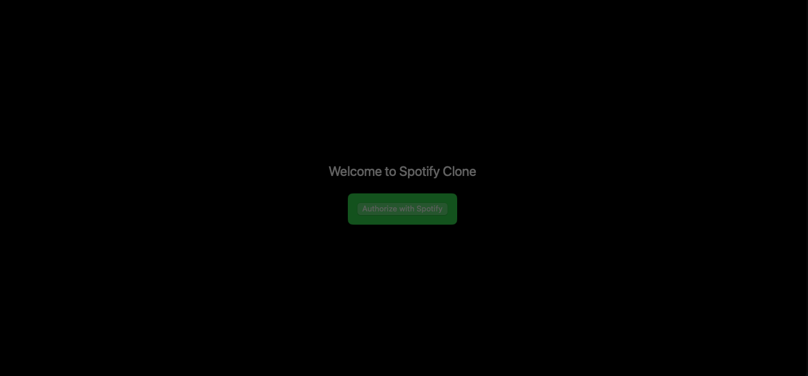

# 🎶 MusicCloneApp

A **SwiftUI-based** music app inspired by Apple Music’s sleek interface and Spotify’s modern design aesthetic!  
This project demonstrates how to integrate **Spotify’s OAuth PKCE flow** for user authentication, fetch real data from the **Spotify Web API**, and display a minimalist, dark-themed, and mobile-focused UI.



## ✨ Features

- **Spotify Integration**: Real user authentication using the OAuth 2.0 Authorization Code Flow with PKCE.  
- **Modern UI**: A slick, dark interface blending Apple’s design principles with a Spotify-like vibe.  
- **SwiftUI & Combine**: A modern codebase using SwiftUI for UI and Combine/async-await for data handling.  
- **Dynamic Content**: Fetches featured and recommended albums from the Spotify API.  
- **Player Controls**: A minimalist Now Playing bar at the bottom of the screen, simulating track playback.

## 🚀 Getting Started

1. **Clone the Repository**:
   ```bash
   git clone https://github.com/yourusername/MusicCloneApp.git
   cd MusicCloneApp
   ```
2. **Open in Xcode**:
   - Open `MusicCloneApp.xcodeproj` (or `.xcworkspace` if using Swift Packages).
   - Make sure you’re running Xcode 14 or later (iOS 14+ compatibility).

3. **Set Your Spotify Credentials**:
   - Sign in to [Spotify Developer Dashboard](https://developer.spotify.com/dashboard/).
   - Create an app, add your **Client ID** and **Redirect URI** to the project:
     - In `AuthViewModel.swift`, replace `"YOUR_CLIENT_ID"` with your client ID.
     - Replace `"myapp://spotify/callback"` with your registered redirect URI.
   - Add the corresponding URL scheme to your Info.plist.

4. **Run the App**:  
   Press **Run** in Xcode. On the first launch, tap **"Authorize with Spotify"**. Sign in and approve scopes. You should now see your personalized home screen and album recommendations!

---

## 🛠 Tech Stack

- **Language**: Swift 5, SwiftUI, Combine
- **Platforms**: iOS (easily adaptable to macOS with conditional compilation)
- **Spotify Web API**: For fetching albums, tracks, and user data.
- **OAuth PKCE**: Secure authentication without exposing a client secret.

## 📚 Code Structure

- **Models/**: Data models for `SpotifyAlbum`, `SpotifyTrack`.
- **Network/**: `SpotifyAPI` and `SpotifyEndpoints` handle requests and data fetching.
- **ViewModels/**:
  - **AuthViewModel**: Manages Spotify OAuth flow.
  - **HomeViewModel**: Fetches featured/recommended albums.
  - **SearchViewModel**: Handles Spotify album searches.
  - **PlayerViewModel**: Simulates track playback state.
- **Views/**:
  - `ContentView`, `AuthView`, `HomeView`, `SearchView`, `LibraryView`
  - `Components/` folder for small reusable UI parts like `AlbumCard`, `AlbumRow`, and `SectionHeader`.

## 🔐 Security & Privacy

- Uses PKCE for secure authorization without storing the client secret in the app.
- Tokens are handled in-memory (consider storing refresh tokens securely in Keychain for production).

## 💡 Future Improvements

- **Real Playback**: Integrate Spotify’s iOS SDK for actual track playback control.
- **Token Refresh**: Automatically refresh expired tokens.
- **More Data**: Display user playlists, saved tracks, and personalized recommendations.
- **Offline Support**: Caching and persistence for offline use.

## 🤝 Contributing

- Feel free to open issues, suggest features, or submit pull requests.
- Follow the project’s coding guidelines and ensure all code passes SwiftLint checks if added.

## ❤️ Acknowledgments

- **Spotify Developer Platform** for the Web API and OAuth flow.
- **SwiftUI & Combine**: The amazing frameworks that simplify iOS development.
- **You** for checking out this project!

## 📜 License

This project is licensed under the MIT License. See [LICENSE](LICENSE) for more details.

📜 License

This project is licensed under the MIT License. See LICENSE for more details.

---
